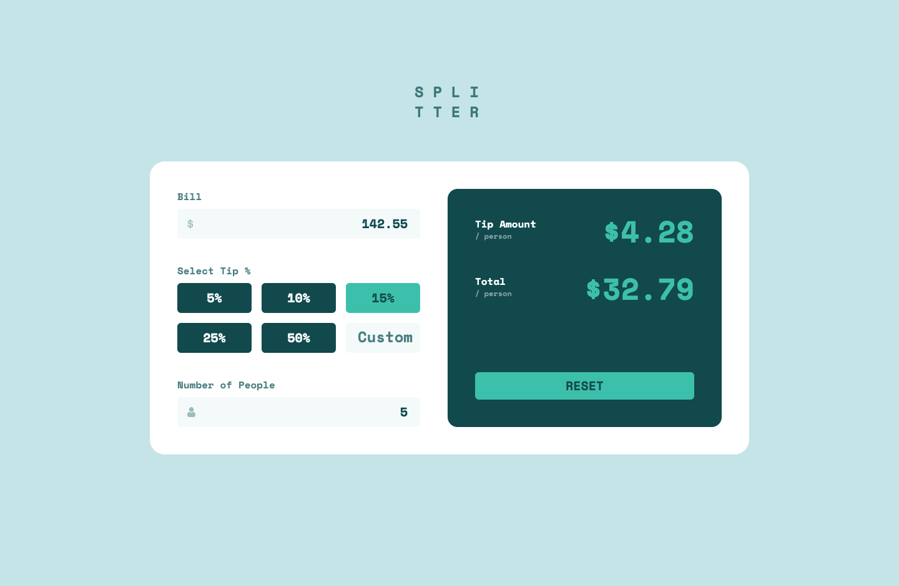
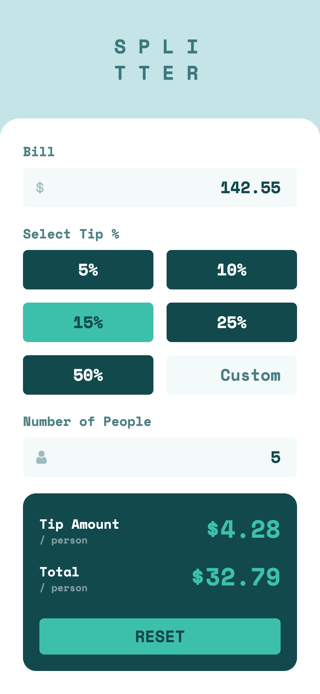

# Frontend Mentor - Tip calculator app solution

This is a solution to the [Tip calculator app challenge on Frontend Mentor](https://www.frontendmentor.io/challenges/tip-calculator-app-ugJNGbJUX). Frontend Mentor challenges help you improve your coding skills by building realistic projects.

## Table of contents

-   [Overview](#overview)
    -   [The challenge](#the-challenge)
    -   [Screenshot](#screenshot)
    -   [Links](#links)
-   [My process](#my-process)
    -   [Built with](#built-with)
    -   [What I learned](#what-i-learned)
-   [Author](#author)

## Overview

### The challenge

Users should be able to:

-   View the optimal layout for the app depending on their device's screen size
-   See hover states for all interactive elements on the page
-   Calculate the correct tip and total cost of the bill per person

### Screenshots

### Links

-   [Solution URL](https://www.frontendmentor.io/solutions/tip-calculator-app-using-tailwind-typescript-and-create-react-app-YD75x7cWwP)
-   [Live Site URL](https://oudajosefu.github.io/tip-calculator-app-main/)

## My process

### Built with

-   Semantic HTML5 markup
-   Tailwind CSS
-   Flexbox
-   CSS Grid
-   Mobile-first workflow
-   [TypeScript](https://www.typescriptlang.org/)
-   [React](https://reactjs.org/) - JS library
-   [Next.js](https://nextjs.org/) - React framework

### What I learned

I had some major breakthroughs with React in this project due to the various minor details with user interaction that I decided to implement. There were some setbacks that I simply overlooked for time's sake, but overall I am pretty proud of the overall outcome. Tailwind came in clutch many, many times and for that I am deeply thankful. However, there were also some times when Tailwind would have a specific trick to do what I wanted that I had to scavenge the internet for and guess and check.

For example, I added a hidden radio button under the custom text input in the tips section. This allowed for deselection of the other buttons in the `name='tip'` group.

I also became more comfortable with labels and their usefulness with internal inputs and divs. For example, I learned that with Tailwind, you can create a div after an input in a label and set its peer to the input so that it would style the whole label accordingly. This was very useful for the two text inputs `Bill` and `Number of People`.

## Author

-   Frontend Mentor - [@oudajosefu](https://www.frontendmentor.io/profile/oudajosefu)
-   Twitter - [@oudajosefu](https://twitter.com/oudajosefu)
